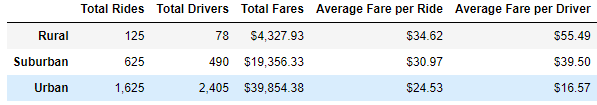

# PyBer_Analysis

Overview of the Analysis

The purpose of this analysis was to look at a couple of different data points regarding people who hired rides in 3 different types of cities; rural, suburband, and urban. Specifically, we were doing a comparitive analysis by city type for total number of fares, average fares per ride, and how many rides each driver had on average. This data wasl analyzed and then further refined in order to narrow it down to a specific time analyzed, January to February.

Results

As the image above shows, urban city areas had the most rides, drivers, and fares, followed by suburban and then rural areas. This makes sense, as urban areas typically tend to be either low income households, where they possibly don't own a vehicle and therefore must use a ride sharing service like ours, or are higher income clients, who use our service as a matter of convenience. Suburban areas understandably don't use our services as much as the places they are most likely trying to get too are farther away, making our service more expensive, plus people living in those areas atre more likely to own their own transportation. The same logic applies to rural areas as well.

This tracks when you look at the average fare per ride or per driver by city type. rural areas actually have the more expensive fares, but it is likely becasue they are travelling from more remote areas and have farther to go before they reach their destination. As previously discussed, this holds true for suburban customers as well. This is why urban, despite having the lowest average fares, is still far and away our top earner becasue despite their travels being to closer areas, they need more rides on average than people in other city types.

Summary

There are a couple of recommendations we can make from this data regarding how best to grow our business in these areas. First, it is recommended to cease any current efforts to grow our business in rural areas. The return is so low in total revenue despite high average fares that spending money on this area would overall not have the desired positive return. Conversly, we recommend the company increase its focus on suburban areas and devise ways to entice customers to use our services in those areas. Average fares are still higher than urban areas, and they account for 10 times as many rides as rural customers. This is most likely the biggest opportunity for growth. Urban areas should also receive some focus to continue growing that customer base, but given that urban areas and suburban areas typcially adjoin each other, it should be done again with an eye on tying in the suburban markets as this will lead to more overall return on investment.